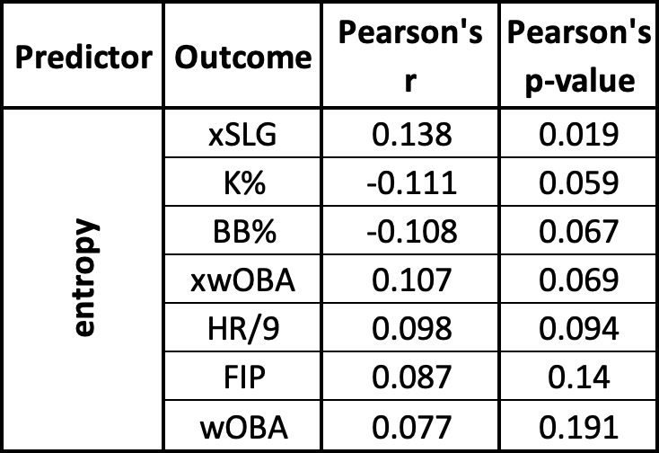
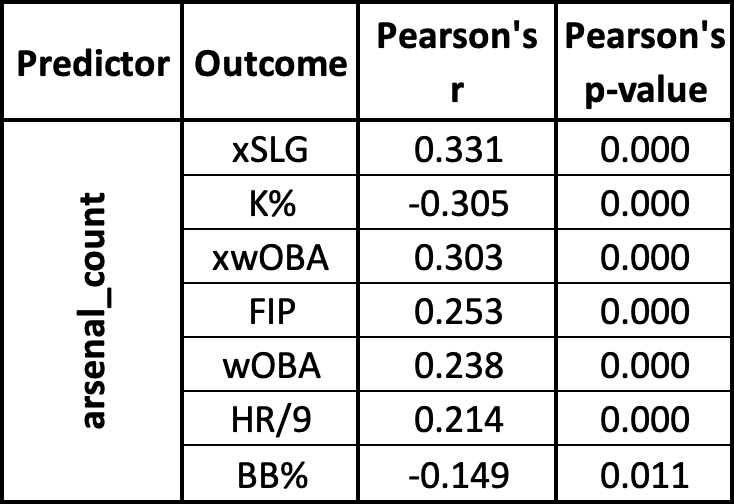
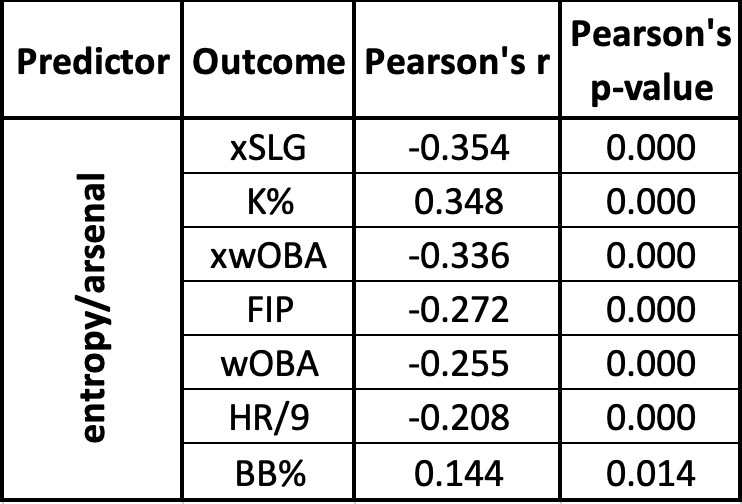

# Entropy/Arsenal

## Overview

Entropy/Arsenal is a metric designed to quantify the diversity of a pitcher's movement profile using entropy-based analysis of MLB Statcast data.

## Motivation

Traditional pitch movement analysis often relies on pitch-type labels and summary statistics. Entropy/Arsenal instead evaluates the overall distribution of a pitcher's movement characteristics, providing a way to quantify movement diversity independent of pitch-type classification.

## Methodology

1) Statcast pitch data are collected using Python's 'pybaseball' package
2) Horizontal and induced vertical break are extracted
3) A 2D kernel density estimate is generated
4) The resulting movement distribution is converted into a probability distribution
5) Shannon entropy is calculated to quantify movement diversity

## Data

Data are from the 2025 MLB regular season along with the post-season and are obtained from MLB Statcast through Python's 'pybaseball' package

## Requirements

Install the required packages with:

```bash
pip install -r requirements.txt
```

## Usage

After installing the required packages, run the analysis with:

```bash
python code/entropy-arsenal.py
```

## Results

Preliminary analysis suggested that Entropy/Arsenal has a positive linear relationship to pitching performance

### Entropy



### Arsenal Count



### Entropy/Arsenal



## Project Status

This project is currently exploratory. Initial analysis has been conducted using 2025 MLB Statcast data, with future work focused on evaluating the stability, interpretation, and potential applications of entropy-based pitcher analysis.

## Future Work

Future work could include, but are not limited to:
1) Expand the metric to include additional characteristics such as velocity, release position, and/or vertical approach angle (VAA).
2) Conduct a multi-season analysis to evaluate the year-to-year stability of Entropy/Arsenal.
3) Apply entropy on a pitch-type basis to evaluate a pitcher's ability to repeat the shape of an individual pitch within their repertoire.
4) Evaluate potential differences in Entropy/Arsenal between starting and relief pitchers.
5) Investigate the relationship between Entropy/Arsenal and a starting pitcher's ability to face a batting order multiple times within an appearance.
